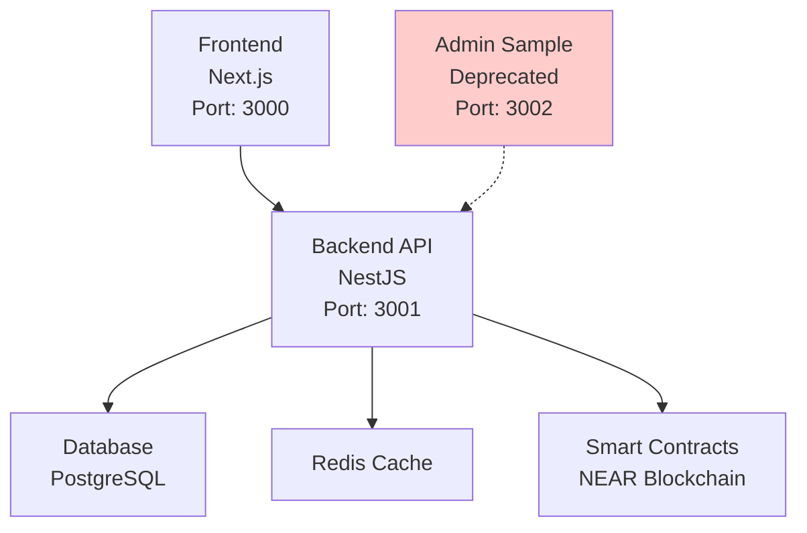

# Tycoon Monorepo Architecture

## Overview

The Tycoon platform is built as a monorepo containing multiple deployable services and supporting components. This document outlines the microservice boundaries, deployment targets, and service relationships.

## Services

### Deployable Services

| Service | Technology | Port | Status | Owner | Description |
|---------|------------|------|--------|-------|-------------|
| `backend/` | NestJS + TypeScript | 3001 | Active | Platform Team | Main API backend handling game logic, user management, and business operations |
| `frontend/` | Next.js + React | 3000 | Active | Frontend Team | Web application providing user interface and client-side functionality |
| `contract/` | Rust + NEAR | N/A | Active | Blockchain Team | Smart contracts deployed to NEAR blockchain for game assets and transactions |

### Samples & Legacy

| Component | Technology | Port | Status | Owner | Description |
|-----------|------------|------|--------|-------|-------------|
| `src/` (root) | NestJS + TypeScript | 3002 | Deprecated | Platform Team | Admin user management sample implementation - use `backend/` for production |

## Architecture Diagram



## Service Boundaries

### Backend Service (`backend/`)
- **Responsibilities**: Game logic, user authentication, inventory management, analytics, webhooks
- **Dependencies**: PostgreSQL, Redis, NEAR contracts
- **APIs**: REST API with OpenAPI/Swagger documentation
- **Deployment**: Docker container, Kubernetes

### Frontend Service (`frontend/`)
- **Responsibilities**: User interface, client-side game rendering, wallet integration
- **Dependencies**: Backend API, NEAR wallet selector
- **Deployment**: Vercel/Netlify or Docker

### Contract Service (`contract/`)
- **Responsibilities**: On-chain game assets, token transactions, smart contract logic
- **Dependencies**: NEAR blockchain
- **Deployment**: NEAR testnet/mainnet

## Development Setup

### Prerequisites
- Node.js 18+
- Rust 1.70+
- PostgreSQL 12+
- Redis
- Docker & Docker Compose

### Single Command Development Matrix

To start all services for development:

```bash
# From monorepo root
npm run dev:all
```

This runs:
- Backend on http://localhost:3001
- Frontend on http://localhost:3000
- Admin sample on http://localhost:3002 (deprecated)

### Individual Service Development

```bash
# Backend
cd backend && npm run start:dev

# Frontend
cd frontend && npm run dev

# Contracts (build only)
cd contract && cargo build
```

## Environment Variables

Each service uses standardized environment variables. See `.env.example` in each service directory.

### Common Variables
- `NODE_ENV`: development/production
- `PORT`: service port
- `DATABASE_URL`: PostgreSQL connection
- `REDIS_URL`: Redis connection
- `NEAR_*`: Blockchain configuration

## Deprecation Notice

The root-level `src/` directory contains a sample admin user management implementation. This has been deprecated in favor of the full-featured backend service. New development should occur in the `backend/` directory.

Migration path:
1. Move admin functionality to `backend/src/modules/admin/`
2. Update any references to use backend endpoints
3. Remove root `src/` after migration complete

## Onboarding

New developers can get started in < 1 day by:
1. Installing prerequisites
2. Running `npm run dev:all` for full stack development
3. Reading service-specific READMEs in each directory
4. Using the architecture diagram to understand service relationships</content>
<parameter name="filePath">/workspaces/Tycoon-Monorepo/docs/architecture.md